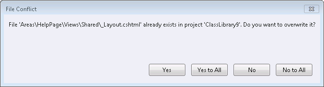

# NuGet 2.5 Release Notes

This release was so big, we felt compelled to skip versions 2.3 and 2.4! To date, this is the largest release we've had for NuGet, with over [160 work items](https://nuget.codeplex.com/workitem/list/advanced?release=NuGet%202.5&status=all) in the release.

## Acknowledgements

We would like to thank the following external contributors for their significant contributions to NuGet 2.5:

1. [Daniel Plaisted](https://www.codeplex.com/site/users/view/dsplaisted) ([@dsplaisted](https://twitter.com/dsplaisted))
    - [#2847](https://nuget.codeplex.com/workitem/2847) - Add MonoAndroid, MonoTouch, and MonoMac to the list of known target framework identifiers.
1. [Andres G. Aragoneses](https://www.codeplex.com/site/users/view/knocte) ([@knocte](https://twitter.com/knocte))
    - [#2865](https://nuget.codeplex.com/workitem/2865) - Fix spelling of NuGet.targets for a case-sensitive OS
1. [David Fowler](https://www.codeplex.com/site/users/view/dfowler) ([@davidfowl](https://twitter.com/davidfowl))
    - Make the solution build on Mono.
1. [Andrew Theken](https://www.codeplex.com/site/users/view/atheken) ([@atheken](https://twitter.com/atheken))
    - Fix unit tests failing on Mono.
1. [Olivier Dagenais](https://www.codeplex.com/site/users/view/OliIsCool) ([@OliIsCool](https://twitter.com/oliiscool))
    - [#2920](https://nuget.codeplex.com/workitem/2920) - nuget.exe pack command does not propagate Properties to msbuild
1. [Miroslav Bajtos](https://www.codeplex.com/site/users/view/MiroslavBajtos) ([@bajtos](https://twitter.com/bajtos))
    - [#1511](https://nuget.codeplex.com/workitem/1511) - Modified XML handling code to preserve formatting.
1. [Adam Ralph](http://www.codeplex.com/site/users/view/adamralph) ([@adamralph](https://twitter.com/adamralph))
    - Added recognized words to custom dictionary to allow build.cmd to succeed.
1. [Bruno Roggeri](https://www.codeplex.com/site/users/view/broggeri)
    - Fix unit tests when running in localized VS.
1. [Gareth Evans](https://www.codeplex.com/site/users/view/garethevans)
    - Extracted interface from PackageService
1. [Maxime Brugidou](https://www.codeplex.com/site/users/view/brugidou) ([@brugidou](https://twitter.com/brugidou))
    - [#936](https://nuget.codeplex.com/workitem/936) - Handle project dependencies when packing
1. [Xavier Decoster](https://www.codeplex.com/site/users/view/XavierDecoster) ([@XavierDecoster](https://twitter.com/xavierdecoster))
    - [#2991](https://nuget.codeplex.com/workitem/2991), [#3164](https://nuget.codeplex.com/workitem/3164) - Support Clear Text Password when storing package source credentials in nuget.cofig files
1. [James Manning](http://www.codeplex.com/site/users/view/jmanning) ([@manningj](https://twitter.com/manningj))
    - [#3190](http://nuget.codeplex.com/workitem/3190), [#3191](http://nuget.codeplex.com/workitem/3191) - Fix Get-Package help description

We also appreciate the following individuals for finding bugs with NuGet 2.5 Beta/RC that were approved and fixed before the final release:

1. [Tony Wall](https://www.codeplex.com/site/users/view/CodeChief) ([@CodeChief](https://twitter.com/codechief))
    - [#3200](https://nuget.codeplex.com/workitem/3200) - MSTest broken with lastest NuGet 2.4 and 2.5 builds

# Notable features in the release

## Allow users to overwrite content files that already exist

One of the most requested features of all time has been the ability to overwrite content files that already exist on disk when included in a NuGet package. Starting with NuGet 2.5, these conflicts are identified and you will be prompted to overwrite the files, whereas previously these files were always skipped.

'NuGet.exe update' and 'Install-Package' now both have a new option '-FileConflictAction' to set some default for command-line scenarios.

Set a default action when a file from a package already exists in the target project. Set to 'Overwrite' to always overwrite files. Set to 'Ignore' to skip files. If not specified, it will prompt for each conflicting file.

## Automatic import of msbuild targets and props files

A new conventional folder has been created at the top level of the NuGet package.  As a peer to \lib, \content, and \tools, you can now include a '\build' folder in your package.  Under this folder, you can place two files with fixed names, {packageid}.targets or {packageid}.props. These two files can be either directly under \build or under framework-specific folders just like the other folders. The rule for picking the best-matched framework folder is exactly the same as in those.

When NuGet installs a package with \build files, it will add an MSBuild &lt;Import&gt; element in the project file pointing to the .targets and .props files. The .props file is added at the top, whereas the .targets file is added to the bottom.

## Specify different references per platform using &lt;References/&gt; element

Before 2.5, in .nuspec file, user can only specify the reference files, to be added for all framework. Now with this new feature in 2.5, user can author the &lt;reference/&gt; element for each of the supported platform, for example:

    <references> 
        <group targetFramework="net45"> 
            <reference file="a.dll" />
        </group> 
        <group targetFramework="netcore45"> 
            <reference file="b.dll" /> 
        </group>
        <group>
            <reference file="c.dll" />
        </group>
    </references>

Here is the flow for how NuGet adds references to projects based on the .nuspec file:

1. Find the lib folder that is appropriate for the target framework and get the list of assemblies from that folder
1. Separately find the references group that is appropriate for the target framework and get the list of assemblies from that group. Reference group without target framework specified is the fallback group.
1. Find the intersection of the two lists, and use that as the references to add

This new feature will allow package authors to use the References feature to apply subsets of assemblies to different frameworks when they would otherwise need to carry duplicate assemblies in multiple lib folders.

Note: you must presently use NuGet.exe pack to use this feature; NuGet Package Explorer does not yet support it.

## Update All button to allow updating all packages at once

Many of you know about the "Update-Package" PowerShell cmdlet to update all of your packages; now there's an easy way to do this through the UI as well.

To try this feature out:

1. Create a new ASP.NET MVC application
1. Launch the 'Manage NuGet Packages' dialog
1. Select 'Updates'
1. Click the 'Update All' button

## Improved project reference support for NuGet.exe Pack

Now nuget.exe pack command processes referenced projects with the following rules:

1. If the referenced project has corresponding nuspec file, e.g. there is a file called proj1.nuspec in the same directory as proj1.csproj, then this project is added as a dependency to the package, using the id and version read from the nuspec file.
1. Otherwise, the files of the referenced project are bundled into the package. Then projects referenced by this project will be processed using the sames rules recursively.
1. All dlls/pdb/exe files are added.
1. All other content files are added.
1. All dependencies are merged.

This allows a referenced project to be treated as a dependency if there is nuspec file, otherwise, it becomes part of the package.

More details here:
[http://nuget.codeplex.com/workitem/936](http://nuget.codeplex.com/workitem/936)

## Add a 'Minimum NuGet Version' property to packages

A new metadata attribute called 'minClientVersion' can now indicate the minimum NuGet client version required to consume a package.

This feature helps package author to specify that a package will work only after a particular version of NuGet. As new nuspec features are added after NuGet 2.5, packages will be able to claim a minimum NuGet version.

    <metadata minClientVersion="2.6">

If the user has NuGet 2.5 installed and a package is identified as requiring 2.6, visual cues will be given to the user indicating the package will not be installable. The user will then be guided to update their version of NuGet.

This will improve upon the existing experience where packages begin to install but then fail indicating an unrecogized schema version was identified.

## Dependencies are no longer unnecessarily updated during package installation

Before NuGet 2.5, when a package was installed that depended on a package already installed in the project, the dependency would be updated as part of the new installation, even if the existing version satisfied the dependency.

Starting with NuGet 2.5, if a dependency version is already satisifed, the dependency will not be updated during other package installations.

**The scenario:**

1. The source repository contains package B with version 1.0.0 and 1.0.2. It also contains package A which has a dependency on B (>= 1.0.0). 
1. Assume that the current project already has package B version 1.0.0 installed. Now you want to install package A. 

**In NuGet 2.2 and older:**

* When installing package A, NuGet will auto-update B to 1.0.2, even though the existing version 1.0.0 already satisfies the dependency version constraint, which is >= 1.0.0. 

**In NuGet 2.5 and newer:**

* NuGet will no longer update B, because it detects that the existing version 1.0.0 satisfies the dependency version constraint.

For more background on this change, read the detailed [work item](http://nuget.codeplex.com/workitem/1681) as well as the related [discussion thread](http://nuget.codeplex.com/discussions/436712).

## NuGet.exe outputs http requests with detailed verbosity

If you are troubleshooting NuGet.exe or just curious what HTTP requests are made during operations, the '-verbosity detailed' switch will now output all HTTP requests made.

## NuGet.exe push now supports UNC and directory sources

Before NuGet 2.5, if you attempted to run 'NuGet.exe push' to a package source based on a UNC path or local directory, the push would fail. With the recently added hierarchical configuration feature, it had become common for NuGet.exe to need to target either a UNC/folder source, or an HTTP-based NuGet Gallery.

Starting with NuGet 2.5, if NuGet.exe identifies a UNC/folder source, it will perform the file copy to the source.

The following command will now work:

    NuGet.exe push -source \\mycompany\repo\ mypackage.1.0.0.nupkg

## NuGet.exe supports explicitly-specified Config files

NuGet.exe commands that acccess configuration (all except 'spec' and 'pack') now support a new '-ConfigFile' option, which forces a specific config file to be used in place of the default config file at %AppData%\nuget\nuget.config.

Example:

    NuGet.exe sources add -name test -source http://test -ConfigFile C:\test\.nuget\nuget.config

## Support for Native projects

With NuGet 2.5, the NuGet tooling is now available for Native projects in Visual Studio. We expect most native packages will utilize the MSBuild imports feature above, using a tool created by the [CoApp project](http://coapp.org). For more information, read [the details about the tool](http://coapp.org/news/2013-03-27-The-Long-Awaited-post.html) on the coapp.org website.

The target framework name of "native" is introduced for packages to include files in \build, \content, and \tools when the package is installed into a native project.  The \lib folder is not used for native projects.

[See NuGet 2.2.1 Release Notes](nuget-2.2.1)
