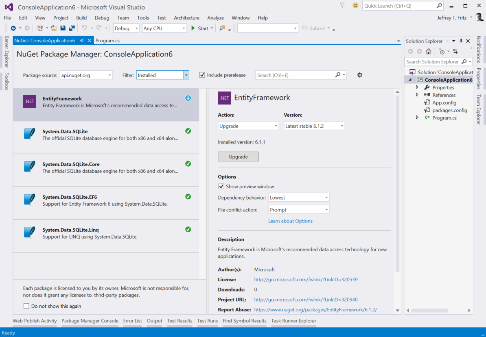

# NuGet 3.0 Beta Release Notes

[NuGet 3.0 Preview Release Notes](nuget-3.0-preview)

NuGet 3.0 Beta was released on February 23, 2015 for the Visual Studio 2015 CTP 6 release. This release means a lot to our team, as we have a number of architecture and performance improvements to share, and we're excited to start tuning the performance settings on our nuget.org service.

## Visual Studio 2012+

This NuGet 3.0 Beta is available to install in the Visual Studio 2015 CTP 6 Extension Gallery. We are working to get preview drops out for Visual Studio 2012 and Visual Studio 2013 very soon. We previously shared our intent to [discontinue updates for Visual Studio 2010](http://blog.nuget.org/20141002/visual-studio-2010.html), and we did make that difficult decision.

## New Client/Server API

We've been working on some implementation details for NuGet's client/server protocol. The work we've done is to create "API v3" for NuGet, which is designed around high availability for critical scenarios such as package restore and installing packages. The new API is based on REST and Hypermedia and we've selected [JSON-LD](http://json-ld.org) as our resource format.

In the NuGet 3.0 Beta bits, you'll see a new package source called "api.nuget.org" in the package source dropdown.   If you select that package source, we'll use our new API rather to connect to nuget.org. In NuGet 3.0 RC, this new API v3-based package source will replace the v2-based "nuget.org" package source.  We recommend disabling all of the other public package sources and leave only api.nuget.org as your only public package repository.  

We've put a lot of time into building our v3 API and will continue to maintain the standard v2 API for old clients seeking to access the public repository.

## Updated UI

We've enhanced the user-interface in this release to include a combobox that will allow you to choose an action to take with the package and transitioned the preview button into a checkbox in the options area of the screen.  The options area is no longer collapsible and now provides a help link describing the options available.

### Operation Logging

We removed the modal window with logging information that would quickly appear and hide while installing or uninstalling.  This window added no value when you would really want to see the information or be able to copy and paste from it.  Instead, we are now redirecting all of the output logging to the Package Manager pane of the Output window.  We think this is more comfortable and similar to a typical build report that you would want to inspect.

### Focus on Performance 

We made a lot of changes in the name of improving performance of NuGet searches, and fetches.  This was our number one concern from our customers, and we wanted to be sure we addressed it in this release.  We've tuned our servers, built out a new CDN, and improved the query matching logic to hopefully deliver to you more relevant and faster package search results.

As we proceed through this phase of the development of NuGet 3.0, we will be tuning and monitoring the nuget.org service to ensure that we deliver an improved experience.  We do not plan to engage in any downtime, but will be adding and changing resources in the service.  Keep an eye on our [twitter feed](http://twitter.com/nuget) for details on when we change the service configuration.

## Building NuGet with NuGet

We have now rearchitected our NuGet clients into several components that are themselves being built into NuGet packages. This re-use of our own libraries forces us to build components that are re-usable and that can be packaged properly.  We have been able to eliminate duplicated code and have learned how to better configure our development process to support the need to build packages throughout our solutions.  Look for a blog post soon where we will talk about how the code projects are structured and how our build process works. 

## Stay Tuned

Please keep an eye on [our blog](http://blog.nuget.org) for more progress and announcements for NuGet 3.0!
