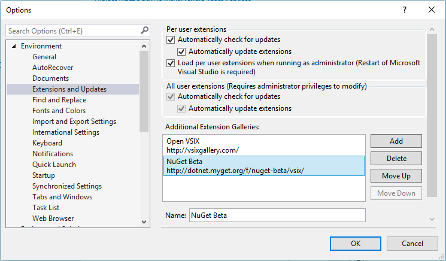
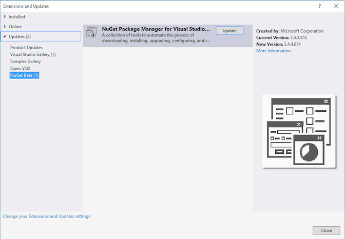

#NuGet Tools

Whether consuming or creating NuGet packages you can use the following tools to meet your needs:

##NuGet.exe Command-line Tool
This utility can be used to create, publish, and download packages. 

How do I get NuGet.exe?
<ol>
<li>1. Download the latest version from here and save the file to a path of your choice.</li>
<li>2. Add this path to the PATH Environment Variable.</li>
</ol>

	<strong>NuGet 2.x users</strong> 
    Because there are a few breaking changes introduced in NuGet 3.2 https://nuget.org/nuget.exe is pointing to the NuGet 2.x latest release, to prevent CI systems from auto upgrading and potentially breaking.

####Try out some scenarios
*  [Creating a package](https://docs.nuget.org/Create/Creating-and-Publishing-a-Package#creating-a-package)
*  [Publishing a Package](https://docs.nuget.org/Create/Creating-and-Publishing-a-Package#publishing-using-nuget-command-line)

####References
* [NuGet.exe commands](https://docs.nuget.org/consume/command-line-reference)

##NuGet Package Manager extension in Visual Studio
Starting with Visual Studio 2012, NuGet is included in every edition (except Team Foundation Server).. This extension includes the package manager UI and the package manager console.

If your copy of Visual Studio does not already have the NuGet Package Manager extension, you can install it using the Extension Manager. 
<ol>
<li>1. In Visual Studio, click Tools and then Extension and Updates.</li>
<li>2. Navigating to Online, search for "NuGet Package Manager for Visual Studio" and click Download.</li>
<li>3. In the Installer dialog box, click Install.</li>
<li>4. When installation is complete, close and re-open Visual Studio.</li>
</ol>

###Package Manager UI
The package manager UI allows you to find, install, remove, and update NuGet packages using Manage NuGet Packages dialog box.

####Try out some scenarios
* [Finding and installing a package](http://docs.nuget.org/Consume/Package-Manager-Dialog#managing-nuget-packages-using-the-dialog)</li>
* [Removing a package](http://docs.nuget.org/Consume/Package-Manager-Dialog#removing-a-package)</li>
* [Updating a Package](http://docs.nuget.org/Consume/Package-Manager-Dialog#updating-a-package)</li>

###Package Manager Console
The package manager console allows you to find, install, remove, and update NuGet packages using PowerShell commands. Some packages and tools during their install (like EntityFramework.) which can be accessed through the package manager console.

	<strong>Note</strong> 
    Package Manager Console commands do not work outside of visual studio since it is dependent on VS objects like DTE to work correctly.

####Try out some scenarios
* [Finding and installing a package](https://docs.nuget.org/Consume/Package-Manager-Console#finding-a-package)</li>
* [Removing a package](https://docs.nuget.org/Consume/Package-Manager-Console#removing-a-package)</li>
* [Updating a Package](https://docs.nuget.org/Consume/Package-Manager-Console#updating-a-package)</li>

####References
* [Package Manager Console Powershell Commands](https://docs.nuget.org/consume/package-manager-console-powershell-reference)
* [Setting up a NuGet Powershell Profile](https://docs.nuget.org/Consume/Setting-up-NuGet-PowerShell-Profile.md)</li>

###Updating NuGet Package Manager extension in Visual Studio
You can update NuGet using the Visual Studio Extension Manager. Navigate to the Extension Manager and click on the Updates tab to check for updates. If there is a new version of NuGet you will see it in the list of available updates. From VS 2015 Update 2, NuGet extension is auto updated by default in Visual Studio.

##NuGet Beta Channel
NuGet Beta Channel for the Visual Studio 2015 NuGet Package Manager gives you access to Beta bits. Even though it's called beta, we will only release near RTM quality builds into this channel. We want to use the extra runway on our end to make sure that we incorporate any feedback that we might get from the users of the channel and catch any blocking issues early on.

	Remember if you run into any issues while dogfooding the beta build or have an idea, <a href="https://github.com/Nuget/Home">open an issue on GitHub</a>.

###Who is this for?
The beta channel is recommended for the following users:
<ol>
<li>1. You like to stay on the latest and greatest.</li>
<li>2. You want to try out new features.</li>
<li>3. You are experiencing a blocking issue and want to get access to the build with the fix before it hits RTM.</li>
</ol>

###How do I get access to the Beta Feed?
You can get access to the Beta builds by the following the steps outlined below.

<ol>
<li>1. Add the Beta Feed: <b>https://dotnet.myget.org/F/nuget-beta/vsix/</b> to the Additional Extension Galleries list in  <b>Tools->Options->Environment->Extensions and Updates</b>. </li>
<li></li>

<li>2. Navigate to <b>Tools->Extensions and Updates</b> and select <b>Online</b>. You should now be able to see the NuGet-Beta Feed there. Install the NuGet Package Manager Extension. </li>
<li></li>
</ol>

##NuGet in .NET CLI
asdasdasdasd

##Package Explorer
If you are <strong>GUI inclined</strong>, use the <a href="/Create/using-a-gui-to-build-packages" class="alert-link">Package Explorer GUI to create packages</a>. 

	<strong>Note</strong> 
	This tool is OSS, not supported by the NuGet team, and is not signed

##How do I choose my tools?
Here is a quick reference to understand your options if you want to consume, create or publish NuGet packages:
